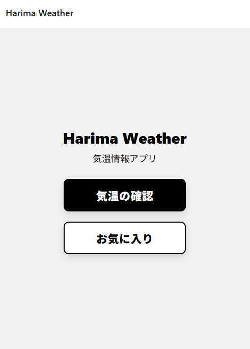
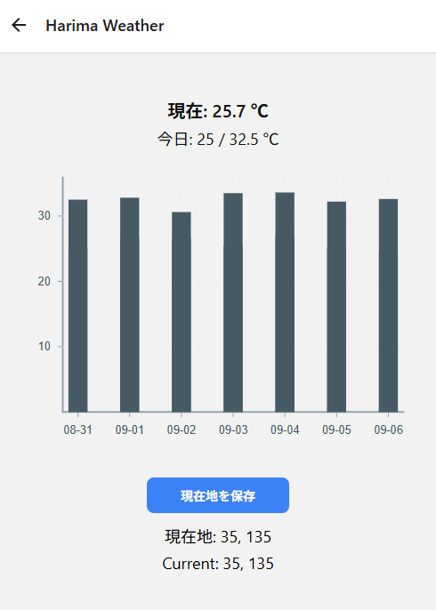

# Harima Weather

[](./LICENSE)
[](https://expo.dev/)
[](https://harima-weather.pages.dev/)

位置情報から現在地の気温を取得し、お気に入り地点を最大3件まで管理できるシンプルな天気アプリです。  
オフラインキャッシュに対応しているため、電波が弱い環境でも予報を確認できます。  
（React Native + Expo 製）

---

### Web（スマホで読み取り）

<a href="https://harima-weather.pages.dev/" target="_blank">
  
</a>  
➡︎ https://harima-weather.pages.dev/

<p align="center">
  
</p>

- 時間ごとの気温を `VictoryLine` でグラフ表示  
  

---

## 主な機能

- 位置情報の取得（expo-location）
- Open-Meteo から現在／日次予報を取得（APIキー不要）
- 現在気温・最高/最低の表示
- 時間ごとの気温を VictoryLine でグラフ表示
- 7日予報を VictoryChart で表示
- お気に入り登録（最大3件・AsyncStorage 保存）
- キャッシュ＋オフライン対応（TTL=30分）
- エラーUI（再試行ボタン／プル更新）

---

## 技術的工夫

- **SWR 風キャッシュ更新**（古いデータを即表示→裏で再取得）
- **明示的リトライ**（勝手に失敗連打しない）
- **軽量化**：`useMemo` / `useCallback` / `React.memo`
- **グラフ**：victory-native ＋ VictoryVoronoiContainer でツールチップ
- **責務分離**：API / hooks / UI を分割

---

## セットアップ

```bash
npm install
npx expo start
```

- Web / Android / iOS のいずれでも実行可能
- Expo Go アプリで QR コードを読み取れば実機確認も可能

---

## よく使うコマンド

```bash
# Web 開発（ブラウザ）
npm run web           # = npx expo start --web

# 静的出力（必要な場合）
npx expo export --platform web

# Android（実機/エミュレータ）
npx expo run:android

# iOS（macOS + Xcode）
npx expo run:ios
```

---

## 参考リンク

- Open-Meteo: https://open-meteo.com/
- Expo: https://expo.dev/
- Victory: https://formidable.com/open-source/victory/

---

## 今後の拡張予定

- 降水量・風速・湿度の表示を追加
- UI の改善（アイコン、テーマ切替）
- キャッシュ管理（LRU削除）

---

## 位置情報とプライバシー

- 初回起動時に位置情報の許可を求めます（現在地の気温取得のため）。
- 位置情報は端末内で処理し、サーバーへ送信しません。
- 許可の取り消し:
  - iOS: 設定 > プライバシーとセキュリティ > 位置情報サービス > Harima Weather
  - Android: 設定 > アプリ > Harima Weather > アプリの権限 > 位置情報

---

## 動作確認環境

- Expo SDK 53 / Expo Router（Static Rendering）
- Web: 最新の Chromium 系ブラウザ（Chrome / Edge）
- モバイル: Expo Go（Android / iOS）

---

## ライセンス

License: [MIT](./LICENSE)

Last updated: 2025-08-31
